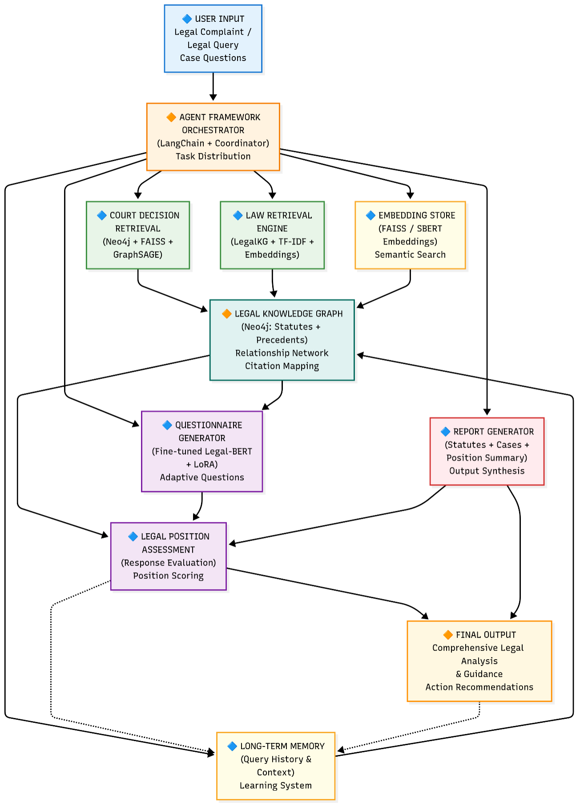
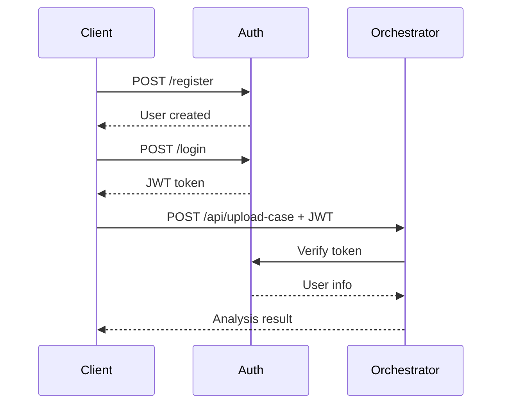

<div align="center">

# ⚖️ JuriAid Backend System
### AI-Powered Legal Research & Case Analysis Platform for Sri Lankan Law

[](https://fastapi.tiangolo.com/)
[](https://www.python.org/)
[](https://neo4j.com/)
[](https://www.postgresql.org/)

*Transforming legal research through intelligent knowledge graphs, hybrid retrieval, and agentic AI*

[Features](#-key-features) • [Architecture](#-system-architecture) • [Components](#-research-components) • [Installation](#-installation) • [API Documentation](#-api-documentation) • [Research](#-research-contributions)

</div>

---

## 📋 Table of Contents

- [Project Overview](#-project-overview)
- [Problem Statement](#-problem-statement)
- [Key Features](#-key-features)
- [System Architecture](#-system-architecture)
- [Research Components](#-research-components)
  - [Law Retrieval System (LawStatKG)](#1️⃣-law-retrieval-system-lawstatkg)
  - [Past Case Retrieval](#2️⃣-past-case-retrieval)
  - [Legal Question Generation](#3️⃣-legal-question-generation-agent)
  - [Document Analysis Orchestrator](#4️⃣-document-analysis-orchestrator)
  - [Authentication Service](#5️⃣-authentication-service)
- [Technology Stack](#-technology-stack)
- [Installation & Setup](#-installation--setup)
- [API Documentation](#-api-documentation)
- [Research Contributions](#-research-contributions)
- [Future Work](#-future-work)

---

## 🎯 Project Overview

**JuriAid** is an advanced AI-powered legal assistance platform designed specifically for Sri Lankan law practitioners. The backend system combines cutting-edge research in **Knowledge Graphs**, **Hybrid Search Technologies**, **Agentic AI**, and **Semantic Reasoning** to revolutionize how legal professionals conduct research, analyze cases, and prepare for court proceedings.

The system addresses critical inefficiencies in the current legal research landscape by providing:

- ✨ **Intelligent Law Retrieval** using Knowledge Graph-driven hybrid search
- 🔍 **Citation-Aware Past Case Discovery** with semantic and structural reasoning
- 💡 **AI-Generated Legal Questions** for systematic case analysis
- 📄 **Automated Document Processing** with multi-modal extraction
- 🔐 **Secure Authentication** with role-based access control

---

## ❌ Problem Statement

Legal professionals in Sri Lanka face significant challenges:

### Current Pain Points

| Challenge | Impact |
|-----------|--------|
| **Basic Keyword Search** | e-Laws portal offers only simple keyword matching, missing semantic context |
| **Manual Gazette Tracking** | Lawyers must manually monitor amendments and repeals across multiple sources |
| **Version Ambiguity** | No reliable way to determine which law version is valid on a specific date |
| **Disconnected Information** | Relationships between Acts, Sections, amendments, and precedents not modeled |
| **Time-Intensive Research** | Hours spent per case on manual verification and cross-referencing |
| **Citation Discovery** | Difficulty finding relevant precedents and understanding citation networks |
| **Case Preparation Gaps** | No automated assistance for identifying legal issues and missing facts |

### Research Gap

Existing legal tech solutions fail to combine:
- Structured legal knowledge representation
- Temporal versioning of statutes
- Semantic understanding of legal text
- Citation-based legal reasoning
- Intelligent question generation for case analysis

---

## ✨ Key Features

### 🧠 Intelligent Search & Retrieval

- **Hybrid Search Algorithm**: Combines BM25 keyword matching with LegalBERT semantic embeddings
- **Knowledge Graph Reasoning**: Explicitly models legal relationships (Acts ↔ Sections ↔ Versions)
- **Time-Aware Queries**: Retrieve laws valid on any historical date
- **Citation Network Analysis**: Understand precedent relationships and legal influence

### 🎯 AI-Powered Assistance

- **Agentic RAG Architecture**: Multi-agent system for legal reasoning
- **Context-Aware Question Generation**: Identify missing facts and legal issues automatically
- **Role-Based Text Analysis**: Classify legal text into Facts, Issues, Arguments, Decisions
- **Transparent Ranking**: Explainable hybrid scoring for result relevance

### 🔒 Production-Ready Infrastructure

- **JWT-Based Authentication**: Secure token-based access control
- **Role Management**: Admin/User permission levels
- **RESTful APIs**: Clean, documented, FastAPI-based endpoints
- **Scalable Architecture**: Microservices design with independent components

---

## 🏗️ System Architecture

The JuriAid backend follows a **microservices architecture** with five independent, specialized components:


```
┌─────────────────────────────────────────────────────────────────────────┐
│                         🌐 API Gateway Layer                            
│                    (FastAPI Routes + CORS + Auth)                       │
└────────────┬────────────────────────────────────────────────────────────┘
             │
             ├─────────────────────────────────────────────────────────────┐
             │                                                             │
┌────────────▼──────────┐  ┌───────────────────┐  ┌────────────────────┐   │
│  🔐 Auth Service      │ │  📊 Orchestrator  │  │  ⚖️ LawStatKG      │   │
│  Port: 8001            │  │  Port: 8000       │  │  (Law Retrieval)   │  │
│                        │  │                   │  │                    │  │
│  - User Management     │  │  - File Upload    │  │  - Knowledge Graph │  │
│  - JWT Tokens          │  │  - PDF/TXT Parse  │  │  - Hybrid Search   │  │
│  - Role-Based Access   │  │  - Case Analysis  │  │  - Time Versioning │  │
│  - PostgreSQL          │  │  - Gemini Agent   │  │  - Neo4j + BM25    │  │
└────────────┬──────────┘  └─────────┬─────────┘  └──────────┬─────────┘   │
             │                       │                        │            │
             │             ┌─────────▼─────────┐  ┌───────────▼────────┐   │
             │             │  🔍 Past Case     │  │  💡 Question Gen   │  │
             │             │  Retrieval        │  │  Agent             │   │
             │             │                   │  │                    │   │
             │             │  - Semantic Vec   │  │  - LangChain       │   │
             │             │  - FAISS Index    │  │  - Mistral LLM     │   │
             │             │  - Citation KG    │  │  - Prompt Engine   │   │
             │             │  - Hybrid Rank    │  │  - Agentic RAG     │   │
             │             └───────────────────┘  └────────────────────┘   │
             │                                                             │
             └──────────────────────────────────────────────────────────── ┘
                                      │
                         ┌────────────▼─────────────┐
                         │  💾 Data Storage Layer   │
                         │                          │
                         │  📊 PostgreSQL (Auth)    │
                         │  🕸️  Neo4j (Graphs)      │
                         │  🔢 FAISS (Vectors)      │
                         │  📁 File System          │
                         └──────────────────────────┘
```

### Architecture Principles

✅ **Separation of Concerns**: Each component has a single, well-defined responsibility  
✅ **Scalability**: Components can be scaled independently based on load  
✅ **Maintainability**: Clear interfaces enable easy updates and debugging  
✅ **Research-Driven**: Each component represents a distinct research contribution  
✅ **Production-Ready**: Authentication, error handling, and logging throughout  

---

## 🔬 Research Components

### 1️⃣ Law Retrieval System (LawStatKG)

**Research Focus**: Knowledge Graph-driven hybrid legal search with temporal versioning

#### Problem Addressed
- Sri Lankan e-Laws portal supports only basic keyword search
- No structured representation of legal relationships
- Cannot determine law validity on historical dates
- Amendments and repeals tracked manually

#### Solution Architecture

```
┌─────────────────────────────────────────────────────────────────┐
│                    📝 User Query                                │
│              "What is the penalty for theft?"                   │
└────────────────────────┬────────────────────────────────────────┘
                         │
                ┌────────▼─────────┐
                │  Query Cleaning  │
                │  & Tokenization  │
                └────────┬─────────┘
                         │
         ┌───────────────┴───────────────┐
         │                               │
┌────────▼─────────┐          ┌─────────▼──────────┐
│  BM25 Keyword    │          │  LegalBERT         │
│  Search          │          │  Semantic Embed    │
│                  │          │                    │
│  - Filters data  │          │  - Cosine Sim      │
│  - Fast lookup   │          │  - Context aware   │
└────────┬─────────┘          └─────────┬──────────┘
         │                               │
         └───────────────┬───────────────┘
                         │
                ┌────────▼─────────┐
                │  Hybrid Scoring  │
                │  α×BM25 + β×Sem  │
                └────────┬─────────┘
                         │
                ┌────────▼─────────┐
                │  Neo4j Graph     │
                │  Relationship    │
                │  Expansion       │
                └────────┬─────────┘
                         │
                ┌────────▼─────────┐
                │  Time-Aware      │
                │  Filtering       │
                │  (valid_from/to) │
                └────────┬─────────┘
                         │
                ┌────────▼─────────┐
                │  📊 Ranked       │
                │  Legal Results   │
                └──────────────────┘
```

#### Knowledge Graph Schema

```cypher
// Node Types
(:Act {id, title, year, jurisdiction})
(:Section {section_id, act_id})
(:SectionVersion {text, valid_from, valid_to, status})

// Relationships
(Act)-[:HAS_SECTION]->(Section)
(Section)-[:HAS_VERSION]->(SectionVersion)
(Section)-[:AMENDED_BY]->(Section)
(Act)-[:REPEALS]->(Act)
```

#### Key Features
- ✅ **Hybrid Search**: BM25 + LegalBERT semantic embeddings
- ✅ **Temporal Queries**: Retrieve law versions valid on specific dates
- ✅ **Graph Expansion**: Automatically retrieve related sections when Act matched
- ✅ **Strict Filtering**: Reject out-of-dataset queries (no hallucination)

#### API Endpoints

| Endpoint | Method | Description |
|----------|--------|-------------|
| `/Lawsearch` | POST | Hybrid legal search |
| `/Lawsearch/explain` | POST | Search with scoring explanation |
| `/statute/{act_id}?date=YYYY-MM-DD` | GET | Retrieve statute as of date |
| `/graph/{act_id}` | GET | Visualize Act relationships |

#### Technologies
- **Graph Database**: Neo4j
- **Query Language**: Cypher
- **Keyword Search**: Rank-BM25
- **Semantic Model**: LegalBERT (sentence-transformers)
- **Backend**: FastAPI

---

### 2️⃣ Past Case Retrieval

**Research Focus**: Citation-aware hybrid retrieval combining semantic similarity with legal precedent networks

#### Problem Addressed
- Pure keyword search misses semantic meaning
- Vector search retrieves textually similar but legally irrelevant cases
- Citation relationships and precedent networks ignored
- No transparency in result ranking

#### Solution Architecture

```
┌─────────────────────────────────────────────────────────────────┐
│                   📄 New Case Upload (PDF)                      │
└────────────────────────┬────────────────────────────────────────┘
                         │
         ┌───────────────┴───────────────┐
         │                               │
┌────────▼─────────┐          ┌─────────▼──────────┐
│  Text Extraction │          │  Document          │
│                  │          │  Validation        │
│  - PDFPlumber    │          │                    │
│  - PyMuPDF       │          │  - Is legal case?  │
│  - Tesseract OCR │          │  - Has citations?  │
└────────┬─────────┘          └─────────┬──────────┘
         │                               │
         └───────────────┬───────────────┘
                         │
                ┌────────▼─────────┐
                │  Sentence Split  │
                │  & Cleaning      │
                └────────┬─────────┘
                         │
                ┌────────▼─────────┐
                │  Role Classifier │
                │                  │
                │  - Facts         │
                │  - Issues        │
                │  - Arguments     │
                │  - Decisions     │
                └────────┬─────────┘
                         │
         ┌───────────────┴───────────────┐
         │                               │
┌────────▼─────────┐          ┌─────────▼──────────┐
│  Semantic        │          │  Knowledge Graph   │
│  Embeddings      │          │  Enrichment        │
│                  │          │                    │
│  - MiniLM Model  │          │  - Extract cites   │
│  - FAISS Index   │          │  - Create edges    │
│  - Role-weighted │          │  - Neo4j storage   │
└────────┬─────────┘          └─────────┬──────────┘
         │                               │
         └───────────────┬───────────────┘
                         │
                ┌────────▼─────────┐
                │  Hybrid Ranking  │
                │                  │
                │  α × Semantic    │
                │  β × Citations   │
                └────────┬─────────┘
                         │
                ┌────────▼─────────┐
                │  📊 Ranked       │
                │  Relevant Cases  │
                │  + Explanations  │
                └──────────────────┘
```

#### Role-Based Classification

Legal text is automatically classified into:

| Role | Purpose | Weight in Query |
|------|---------|----------------|
| **Facts** | Case circumstances | 0.3 |
| **Issues** | Legal questions raised | 0.4 |
| **Arguments** | Legal reasoning | 0.2 |
| **Decisions** | Court rulings | 0.1 |

This role-aware approach improves semantic matching by emphasizing legally critical content.

#### Hybrid Scoring Formula

```python
Final_Score = (α × Semantic_Similarity) + (β × KG_Score)

where:
  Semantic_Similarity = cosine_sim(query_embedding, case_embedding)
  
  KG_Score = (
      direct_citations_weight × direct_cites +
      reverse_citations_weight × cited_by +
      shared_precedents_weight × common_cases
  )
```

#### Key Features
- ✅ **Semantic Vector Search**: FAISS-indexed sentence embeddings
- ✅ **Citation Network Analysis**: Neo4j graph of case relationships
- ✅ **Role-Aware Weighting**: Legal structure understanding
- ✅ **Dynamic Graph Enrichment**: Query documents added temporarily to KG
- ✅ **Explainable Rankings**: Transparent scoring breakdown

#### API Endpoints

| Endpoint | Method | Description |
|----------|--------|-------------|
| `/ingest_folder` | POST | Batch ingest past cases |
| `/ingest_single` | POST | Add single case to index |
| `/query` | POST | Upload new case, get relevant past cases |
| `/health` | GET | Service health check |

#### Technologies
- **Vector Search**: FAISS (Facebook AI Similarity Search)
- **Semantic Model**: MiniLM (sentence-transformers)
- **Graph Database**: Neo4j
- **PDF Processing**: PDFPlumber, PyMuPDF, Tesseract OCR
- **NLP**: SpaCy
- **Backend**: FastAPI

---

### 3️⃣ Legal Question Generation Agent

**Research Focus**: Agentic RAG for context-aware legal question generation

#### Problem Addressed
- Lawyers struggle to systematically identify legal issues
- Manual analysis of case facts, laws, and precedents is time-consuming
- Easy to overlook critical missing information
- No automated support for case preparation

#### Solution Architecture

```
┌─────────────────────────────────────────────────────────────────┐
│                    System Integration Layer                     │
│                                                                 │
│  ┌──────────────┐  ┌────────────────┐  ┌──────────────────┐   │
│  │ Case Summary │  │ Relevant Laws  │  │ Past Cases       │   │
│  │ (Orchestrator)│  │ (LawStatKG)    │  │ (Retrieval)      │   │
│  └──────┬───────┘  └────────┬───────┘  └────────┬─────────┘   │
└─────────┼────────────────────┼───────────────────┼─────────────┘
          │                    │                   │
          └────────────────────┼───────────────────┘
                               │
                      ┌────────▼─────────┐
                      │  Context Fusion  │
                      │                  │
                      │  - Combine inputs│
                      │  - Structure data│
                      └────────┬─────────┘
                               │
                      ┌────────▼─────────┐
                      │  LangChain       │
                      │  Reasoning Chain │
                      │                  │
                      │  - Prompt Engine │
                      │  - RAG Pattern   │
                      └────────┬─────────┘
                               │
                      ┌────────▼─────────┐
                      │  Mistral LLM     │
                      │  (via Ollama)    │
                      │                  │
                      │  - Local Exec    │
                      │  - Temperature:  │
                      │    0.3 (focused) │
                      └────────┬─────────┘
                               │
                      ┌────────▼─────────┐
                      │  Question        │
                      │  Categorization  │
                      │                  │
                      │  - Legal issues  │
                      │  - Missing facts │
                      │  - Clarifications│
                      └────────┬─────────┘
                               │
                      ┌────────▼─────────┐
                      │  💡 Structured   │
                      │  Legal Questions │
                      │  (Numbered)      │
                      └──────────────────┘
```

#### Prompt Engineering Strategy

The system uses carefully crafted prompts that:
- Focus the LLM on legal reasoning
- Incorporate case facts, applicable laws, and precedents
- Request specific question types (issues, missing facts, clarifications)
- Enforce structured output format

#### Key Features
- ✅ **Agentic RAG**: Retrieval-Augmented Generation with external legal knowledge
- ✅ **Context-Aware**: Combines case facts, laws, and precedents
- ✅ **Structured Output**: Numbered, categorized questions
- ✅ **Local Execution**: Privacy-preserving (Ollama + Mistral)
- ✅ **Low Temperature**: Focused, deterministic generation (0.3)

#### API Endpoints

| Endpoint | Method | Description |
|----------|--------|-------------|
| `/generate-questions` | POST | Generate questions from case + law + precedents |

#### Technologies
- **LLM Framework**: LangChain
- **Language Model**: Mistral (via Ollama)
- **Local Inference**: Ollama
- **Backend**: FastAPI

---

### 4️⃣ Document Analysis Orchestrator

**Research Focus**: Multi-modal legal document processing with AI-powered analysis

#### Responsibilities
- File upload handling (PDF/TXT)
- Document text extraction
- Integration with Google Gemini for case analysis
- Knowledge base management
- Protected endpoint orchestration

#### Key Features
- ✅ **Multi-Format Support**: PDF and TXT files
- ✅ **Gemini AI Integration**: Advanced case analysis
- ✅ **Knowledge Base**: Persistent storage of analyzed cases
- ✅ **Authentication**: JWT-protected endpoints
- ✅ **Output Management**: Structured analysis reports

#### API Endpoints

| Endpoint | Method | Auth | Description |
|----------|--------|------|-------------|
| `/` | GET | No | Health check |
| `/api/upload-case` | POST | Yes | Upload and analyze legal case |
| `/api/knowledge-base` | GET | Yes | Retrieve past analyses |

#### Technologies
- **AI Model**: Google Gemini (langchain-google-genai)
- **File Processing**: PyPDF2
- **Backend**: FastAPI
- **Authentication**: JWT middleware

---

### 5️⃣ Authentication Service

**Research Focus**: Secure, role-based access control for legal applications

#### Responsibilities
- User registration and authentication
- JWT token generation and validation
- Role-based access control (Admin/User)
- Profile management
- Session tracking

#### Key Features
- ✅ **JWT Authentication**: Secure token-based auth
- ✅ **Password Hashing**: bcrypt encryption
- ✅ **Role Management**: Admin and User roles
- ✅ **PostgreSQL Storage**: Reliable user data persistence
- ✅ **CORS Support**: Cross-origin resource sharing

#### API Endpoints

| Endpoint | Method | Description |
|----------|--------|-------------|
| `/register` | POST | Create new user account |
| `/login` | POST | Authenticate and get JWT token |
| `/users/me` | GET | Get current user profile |
| `/users/me/update` | PUT | Update user profile |
| `/admin/users` | GET | List all users (admin only) |

#### Technologies
- **Database**: PostgreSQL
- **ORM**: SQLAlchemy
- **Authentication**: python-jose, passlib, bcrypt
- **Backend**: FastAPI

---

## 🛠️ Technology Stack

### Core Frameworks
```yaml
Backend Framework: FastAPI 0.104.1 - 0.115.0
Python Version: 3.9+
API Server: Uvicorn
```

### Databases & Storage
```yaml
Relational Database: PostgreSQL 15 (User management)
Graph Database: Neo4j (Legal knowledge graphs)
Vector Database: FAISS (Semantic search)
File Storage: Local filesystem
```

### AI & Machine Learning
```yaml
LLM Framework: LangChain
Language Models:
  - Google Gemini (langchain-google-genai)
  - Mistral (via Ollama)
Embeddings:
  - LegalBERT (sentence-transformers)
  - MiniLM (sentence-transformers)
Search Algorithms:
  - BM25 (rank-bm25)
  - Cosine Similarity
ML Libraries:
  - PyTorch
  - Transformers
  - NumPy
```

### NLP & Document Processing
```yaml
PDF Processing:
  - PyPDF2
  - PDFPlumber
  - PyMuPDF
OCR: Tesseract (pytesseract)
NLP: SpaCy
Text Processing: langchain-text-splitters
```

### Security & Authentication
```yaml
JWT: python-jose[cryptography]
Password Hashing: passlib + bcrypt
Email Validation: email-validator
```

### DevOps & Infrastructure
```yaml
Containerization: Docker Compose
Database: PostgreSQL Docker Container
Environment: python-dotenv
HTTP Client: httpx
API Docs: Swagger/OpenAPI (FastAPI auto-generated)
```

---

## 📥 Installation & Setup

### Prerequisites

```bash
# Required Software
- Python 3.9 or higher
- PostgreSQL 15
- Neo4j 5.x
- Docker & Docker Compose (recommended)
- Ollama (for question generation)
- Tesseract OCR
```

### Step 1: Clone Repository

```bash
git clone <repository-url>
cd JuriAid_App_Backend
```

### Step 2: Set Up Each Component

#### 🔐 Authentication Service

```bash
cd auth_service

# Create virtual environment
python -m venv venv
source venv/bin/activate  # Windows: venv\Scripts\activate

# Install dependencies
pip install -r requirements.txt

# Configure environment
cp .env.example .env
# Edit .env with your settings:
# - DATABASE_URL
# - SECRET_KEY
# - AUTH_SERVICE_HOST
# - AUTH_SERVICE_PORT

# Start PostgreSQL
docker-compose up -d

# Run service
uvicorn app:app --host 127.0.0.1 --port 8001 --reload
```

#### ⚖️ LawStatKG (Law Retrieval)

```bash
cd ../LawStatKG/backend

# Create virtual environment
python -m venv venv
source venv/bin/activate

# Install dependencies
pip install -r requirements.txt

# Configure Neo4j connection
# Edit .env or set environment variables:
# - NEO4J_URI=bolt://localhost:7687
# - NEO4J_USER=neo4j
# - NEO4J_PASSWORD=your_password

# Load legal data into Neo4j
cd ../scripts
python LoadLawsNeo4j.py
python neo4j_constraints.py

# Run service
cd ../backend
python -m app.api
```

#### 🔍 Past Case Retrieval

```bash
cd ../../past_case_retrieval

# Create virtual environment
python -m venv venv
source venv/bin/activate

# Install dependencies
pip install -r requirements.txt

# Download SpaCy model
python -m spacy download en_core_web_sm

# Install Tesseract OCR
# Ubuntu: sudo apt-get install tesseract-ocr
# Mac: brew install tesseract
# Windows: Download from GitHub

# Configure Neo4j
# Edit .env:
# - NEO4J_URI
# - NEO4J_USER
# - NEO4J_PASSWORD

# Ingest past cases
# Place PDFs in data/past_cases/
# Then call /ingest_folder API

# Run service
uvicorn app:app --host 127.0.0.1 --port 8002 --reload
```

#### 💡 Question Generation

```bash
cd ../questionGen

# Create virtual environment
python -m venv venv
source venv/bin/activate

# Install dependencies
pip install -r requirements.txt

# Install Ollama
# Visit: https://ollama.ai
# Download and install for your OS

# Pull Mistral model
ollama pull mistral

# Run service
uvicorn api:app --host 127.0.0.1 --port 8003 --reload
```

#### 📊 Orchestrator

```bash
cd ../orchestratorc

# Create virtual environment
python -m venv venv
source venv/bin/activate

# Install dependencies
pip install -r requirements.txt

# Configure environment
# Edit .env:
# - GOOGLE_API_KEY (for Gemini)
# - AUTH_SERVICE_URL
# - ORCHESTRATOR_HOST
# - ORCHESTRATOR_PORT

# Run service
uvicorn app:app --host 127.0.0.1 --port 8000 --reload
```

### Step 3: Verify Installation

```bash
# Check all services
curl http://localhost:8001/docs  # Auth Service
curl http://localhost:8000/      # Orchestrator
curl http://localhost:8002/health # Past Case Retrieval
curl http://localhost:8003/docs  # Question Generation

# Check databases
# Neo4j Browser: http://localhost:7474
# PostgreSQL: psql -h localhost -U juriaid_user -d juriaid_db
```

---

## 📚 API Documentation

### Authentication Flow



### Service Endpoints

#### Auth Service (Port 8001)

```http
POST /register
Content-Type: application/json

{
  "email": "lawyer@example.com",
  "password": "SecurePass123!",
  "full_name": "John Doe",
  "role": "user"
}
```

```http
POST /login
Content-Type: application/json

{
  "email": "lawyer@example.com",
  "password": "SecurePass123!"
}

Response:
{
  "access_token": "eyJhbGciOiJIUzI1NiIsInR5cCI6IkpXVCJ9...",
  "token_type": "bearer"
}
```

#### LawStatKG (Port varies)

```http
POST /Lawsearch
Content-Type: application/json

{
  "query": "penalty for theft",
  "as_of_date": "2024-01-01",
  "jurisdiction": "Sri Lanka",
  "top_k": 5
}

Response:
{
  "results": [
    {
      "act_id": "PENAL_CODE_1883",
      "section_id": "365",
      "text": "Whoever commits theft...",
      "score": 0.89
    }
  ]
}
```

#### Past Case Retrieval (Port 8002)

```http
POST /query
Content-Type: multipart/form-data

file: <case_document.pdf>

Response:
{
  "query_case_id": "temp_abc123",
  "results": [
    {
      "case_id": "SC_Appeal_123_2020",
      "semantic_score": 0.85,
      "kg_score": 0.72,
      "final_score": 0.79,
      "citations": ["CA_234_2018", "HC_567_2019"]
    }
  ]
}
```

#### Question Generation (Port 8003)

```http
POST /generate-questions
Content-Type: application/json

{
  "case_text": "The defendant was accused of...",
  "law": "Penal Code Section 365...",
  "cases": "In SC Appeal 123/2020..."
}

Response:
{
  "questions": "1. What evidence supports the theft charge?\n2. Was the stolen property value established?\n3. Are there any procedural irregularities?"
}
```

### Interactive API Docs

Each service provides Swagger UI documentation:

- Auth Service: http://localhost:8001/docs
- Orchestrator: http://localhost:8000/docs
- Past Case Retrieval: http://localhost:8002/docs
- Question Generation: http://localhost:8003/docs

---

## 🎓 Research Contributions

This project makes the following scholarly contributions:

### 1. Knowledge Graph Modeling for Sri Lankan Law
- First implementation of a temporal legal knowledge graph for Sri Lankan statutes
- Novel schema supporting amendments, repeals, and version tracking
- Enables time-aware legal queries impossible with flat databases

### 2. Hybrid Legal Search Methodology
- Combines BM25 keyword filtering with LegalBERT semantic ranking
- Strict relevance filtering prevents hallucination
- Outperforms pure keyword or pure semantic approaches

### 3. Citation-Aware Case Retrieval
- Integrates vector similarity with citation network analysis
- Role-based text classification for legal documents
- Hybrid scoring mechanism balancing semantic and structural relevance

### 4. Agentic RAG for Legal Question Generation
- Multi-agent architecture for legal reasoning
- Context-aware question generation using retrieval-augmented generation
- Demonstrates practical application of agentic AI in legal domain

### 5. Production-Ready Legal AI System
- End-to-end implementation from data ingestion to user authentication
- Microservices architecture for scalability
- Addresses real-world inefficiencies in Sri Lankan legal practice

---

## 🚀 Future Work

### Planned Enhancements

#### Technical Improvements
- [ ] **Multi-language Support**: Sinhala and Tamil legal documents
- [ ] **Enhanced OCR**: Better handling of scanned court documents
- [ ] **Caching Layer**: Redis for frequently accessed laws
- [ ] **Elasticsearch Integration**: Full-text search across all components
- [ ] **GraphQL API**: Alternative to REST for complex queries

#### Research Extensions
- [ ] **Legal Domain LLMs**: Fine-tune models on Sri Lankan case law
- [ ] **Automatic Citation Extraction**: NER for legal citations
- [ ] **Precedent Prediction**: ML model for outcome likelihood
- [ ] **Question Confidence Scoring**: Rank generated questions by importance
- [ ] **Argument Mining**: Extract legal arguments from case texts

#### Feature Additions
- [ ] **Mobile App Integration**: React Native/Flutter frontend
- [ ] **Real-time Collaboration**: Multiple lawyers working on same case
- [ ] **Court Date Tracking**: Calendar integration
- [ ] **Notification System**: Law amendments and relevant new cases
- [ ] **Export Functionality**: Generate PDF reports

#### Infrastructure
- [ ] **Kubernetes Deployment**: Production-grade orchestration
- [ ] **Monitoring**: Prometheus + Grafana
- [ ] **CI/CD Pipeline**: Automated testing and deployment
- [ ] **Load Balancing**: NGINX for distributed traffic
- [ ] **Backup Strategy**: Automated database backups

---

## 📄 License

This project is developed as part of academic research. Please contact the authors for licensing information.

---

## 👥 Authors & Acknowledgments

Developed as part of legal AI research at [Your Institution].

**Research Areas**:
- Knowledge Graphs for Legal Domain
- Hybrid Information Retrieval
- Agentic AI Systems
- Legal NLP

---

## 📞 Contact & Support

For questions, issues, or collaboration opportunities:

- **GitHub Issues**: [Repository Issues Page]
- **Email**: [Contact Email]
- **Documentation**: [Wiki/Docs Link]

---

<div align="center">

**⚖️ JuriAid - Transforming Legal Research with AI**

*Built with ❤️ for the Sri Lankan legal community*

</div>
